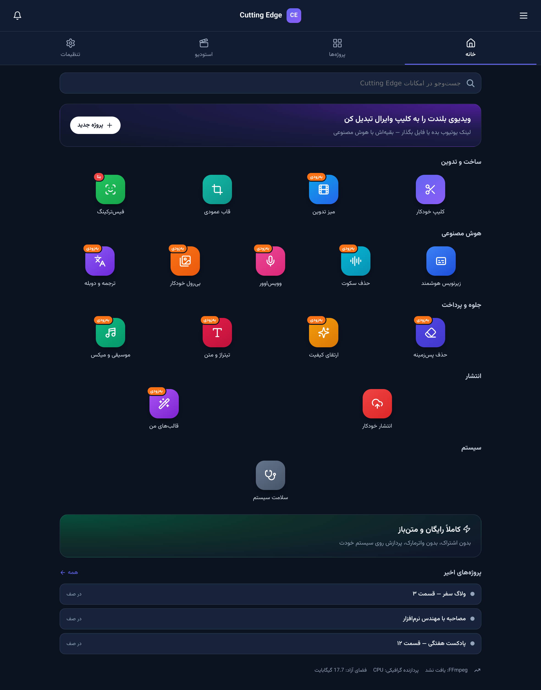
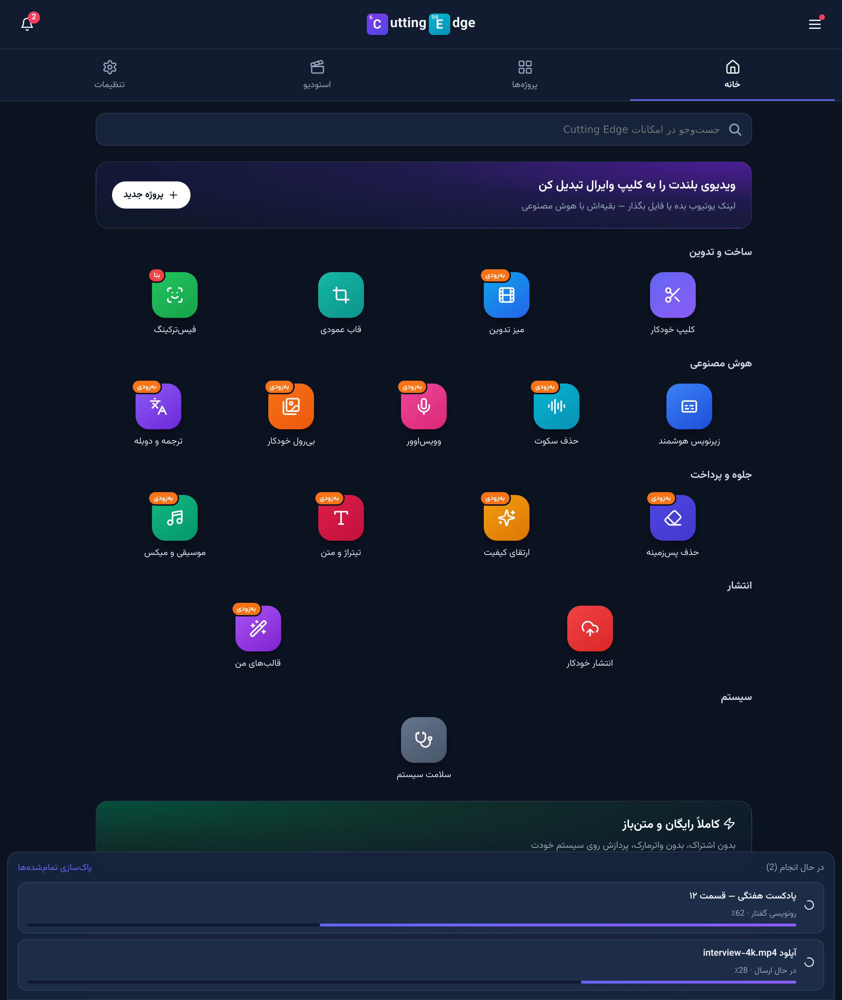
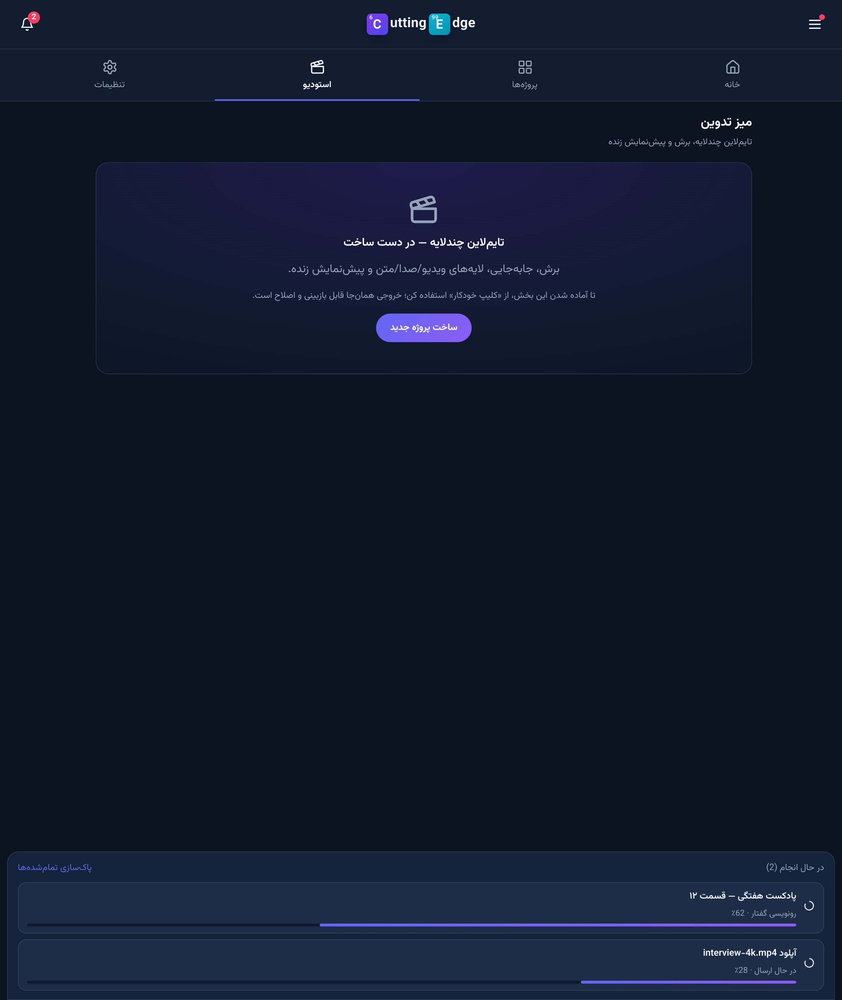

# Cutting Edge — UI screenshots

Real captures of the running app (Vite dev server + FastAPI backend), not mockups.

## Home — super-app launcher

Sticky header with the CE mark and an activity counter, RTL tab bar
(خانه / پروژه‌ها / استودیو / تنظیمات), feature search, call-to-action banner and a
colour-coded feature grid grouped into ساخت و تدوین · هوش مصنوعی · جلوه و پرداخت ·
انتشار · سیستم. Features that are not implemented yet carry an honest «به‌زودی» badge.

## Background work that survives navigation

The docked "در حال انجام" strip is rendered by the app shell, and its state lives in a
store outside the router — switching tabs never cancels or resets a running job or
upload.

## Studio placeholder

The multi-track timeline is the next milestone (P1 in
`docs/CuttingEdge/ROADMAP_EDITOR.md`); until then the screen says so plainly and points
back to the working automatic-clipping flow.
