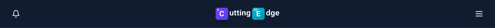
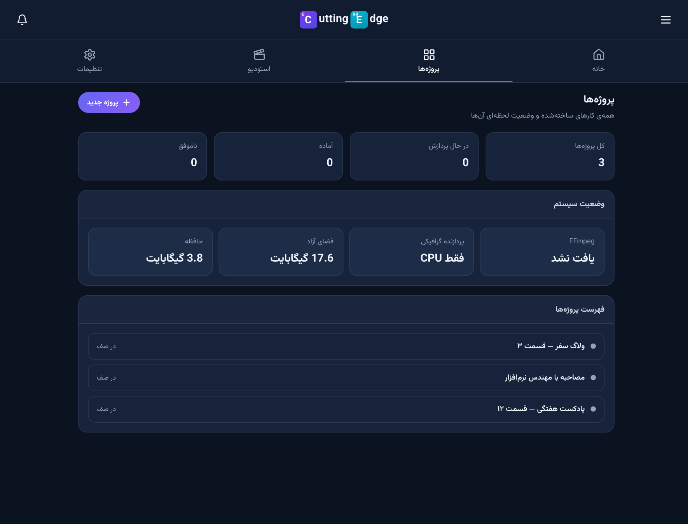
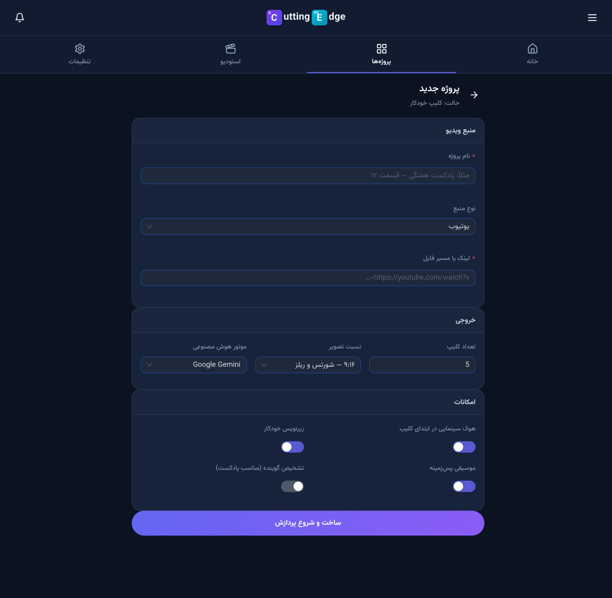
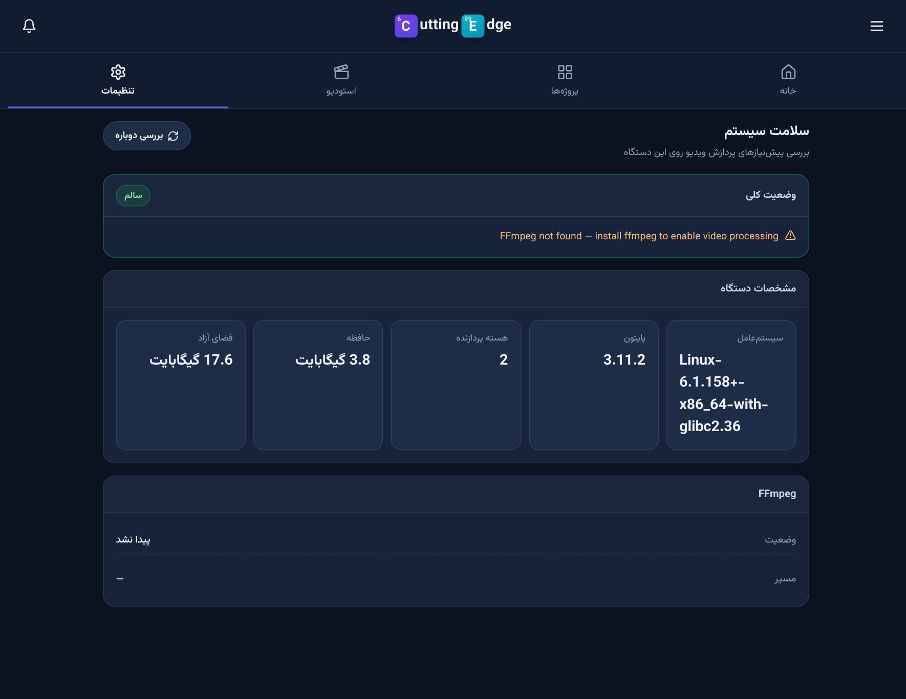
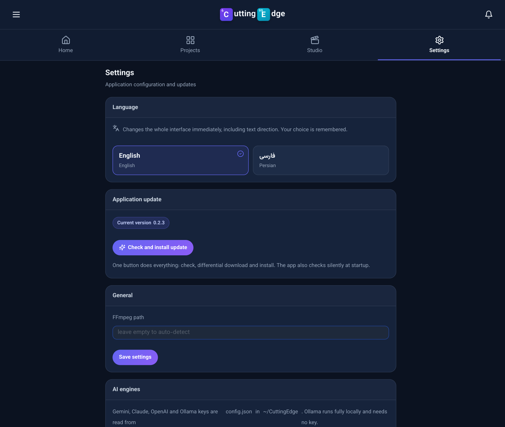

# Cutting Edge — UI screenshots

Real captures of the running app (Vite dev server + FastAPI backend), not mockups.

## Wordmark

Breaking Bad style: the product name is spelled out, but the initials sit in
periodic-table element boxes — C (6) in violet, E (99) in cyan.

## Home — super-app launcher

Sticky header with the CE mark and an activity counter, RTL tab bar
(خانه / پروژه‌ها / استودیو / تنظیمات), feature search, call-to-action banner and a
colour-coded feature grid grouped into ساخت و تدوین · هوش مصنوعی · جلوه و پرداخت ·
انتشار · سیستم. Features that are not implemented yet carry an honest «به‌زودی» badge.

## Background work that survives navigation

The docked "در حال انجام" strip is rendered by the app shell, and its state lives in a
store outside the router — switching tabs never cancels or resets a running job or
upload.

## Projects, new job, diagnostics

Every screen renders through the same `Page` shell (identical width, heading
position, spacing and a reserved gap for the task dock), so switching sections
never produces overlapping cards or drifting typography. Numbers, paths and URLs
are isolated LTR inside Persian sentences.

## Studio — working multi-track timeline

Shipped in 0.2.3: program monitor, clip inspector, transport/edit toolbar and a
three-lane timeline. Clips can be dragged between lanes, trimmed from either edge,
split at the playhead (S), duplicated (Ctrl+D) and deleted, with magnetic snapping,
zoom and full undo/redo (Ctrl+Z). Media is never touched — the edit model is pure
data, which is what the render engine will consume next.
