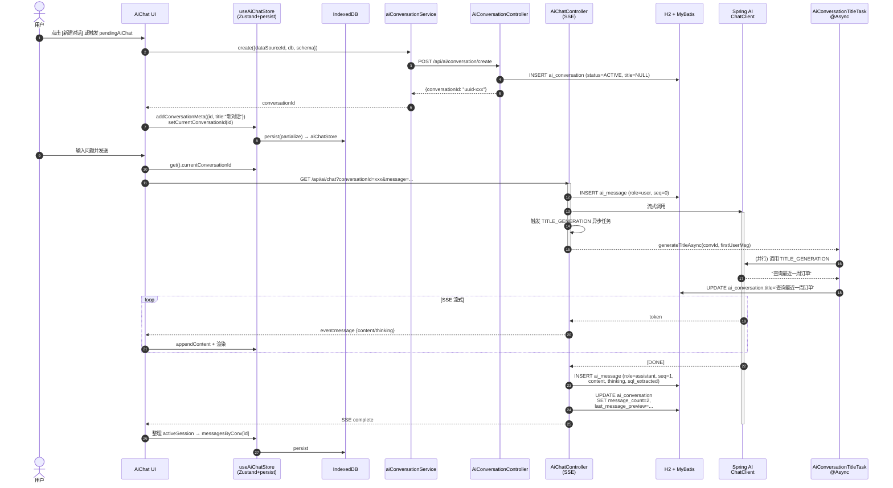
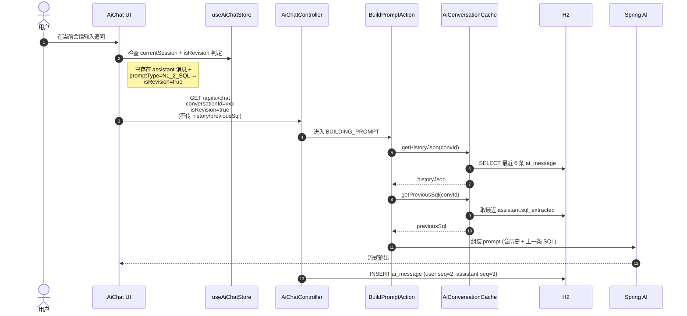
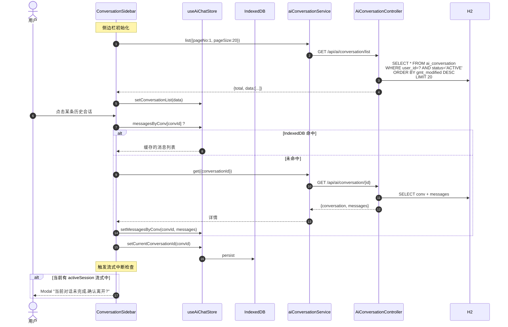
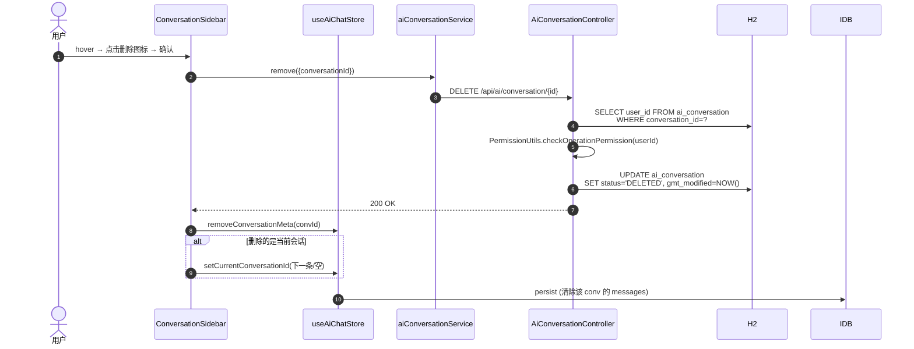
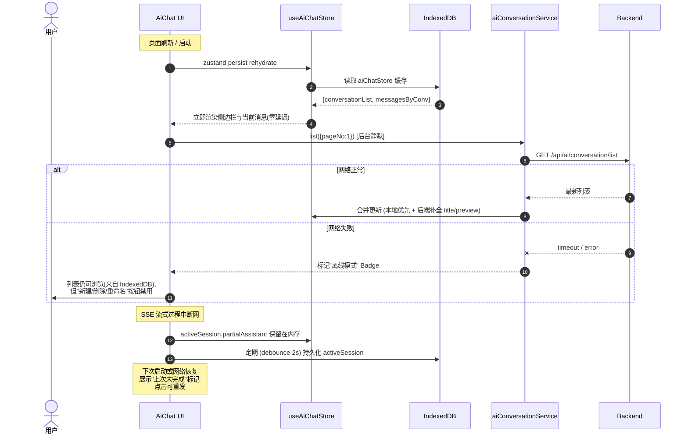

# AI 连续对话重构方案

> **状态**: 待审核
> **范围**: 前端 AiChat 面板 + 后端 AI 聊天全链路
> **目标**: 把"仅内存、单会话、刷新即失"的 AI 聊天改造成"多会话、按用户隔离、跨刷新可恢复"的 ChatGPT 风格连续对话

---

## 目录

1. [现状分析](#一-现状分析)
2. [核心痛点](#二-核心痛点)
3. [设计决策](#三-设计决策)
4. [整体架构](#四-整体架构)
5. [后端实现](#五-后端实现)
6. [前端实现](#六-前端实现)
7. [关键边界与设计决策](#七-关键边界与设计决策)
8. [实施步骤](#八-实施步骤)
9. [时序图](#九-时序图)
10. [待拍板的开放问题](#十-待拍板的开放问题)

---

## 一、现状分析

### 1.1 前端

| 模块 | 文件 | 关键发现 |
|---|---|---|
| AI 面板主组件 | `chat2db-client/src/components/AiChat/index.tsx` (850 行) | 单一巨型文件,内含 ThinkingBlock / ExplainPanel / SqlActionButtons / InputArea / TableSelector |
| AI Store | `chat2db-client/src/pages/main/workspace/store/aiChatStore.ts` (190 行) | `sessions: Map<string, AiChatSession>`,**未接入 persist 中间件**,刷新即失 |
| 触发点 | 6 处 `setPendingAiChat({...})` 调用 | `ConsoleEditor` / `SearchResult` / `ImportDataModal` / `DataGenerationModal` / `ViewAllTable` / `DatabaseTableEditor` |
| 持久化 | `chat2db-client/src/indexedDB/table.ts` (48 行) | 仅 1 张表 `workspaceConsoleDDL`,无 AI 相关表 |
| Store 持久化范式 | `pages/main/workspace/store/index.ts` | 已用 `zustand/middleware/persist` 包装 `useWorkspaceStore` (只 persist layout/currentConnectionDetails) |
| 接入位置 | `pages/main/workspace/components/WorkspaceExtend/config.tsx` | AI 作为右侧全局组件,以图标切换 |

### 1.2 后端

| 模块 | 文件 | 关键发现 |
|---|---|---|
| 控制器 | `chat2db-server/.../controller/ai/ChatController.java` (229 行) | 3 个端点:`/api/ai/chat/payload` (POST)、`/api/ai/chat` (GET SSE)、`/api/ai/chat/{uid}` (DELETE 取消) |
| 状态机 | `controller/ai/statemachine/ChatStateMachineConfig.java` | Spring Statemachine 4.0.0,6 状态 16 事件,所有 Action 在 web-api 层 |
| 会话缓存 | `controller/ai/service/AiConversationCache.java` (118 行) | **Guava 5MB / 10min TTL,纯内存,重启即失**;仅保留最近 6 条用于 prompt 组装 |
| 请求 DTO | `controller/ai/request/ChatQueryRequest.java` (71 行) | 已含 `conversationId / history / previousSql / isRevision` 字段,前端已传但后端只在 prompt 中用 |
| 配置 | `config/AiChatConfig.java` (200 行) | Spring AI ChatClient 工厂,支持 OpenAI / Anthropic / Azure OpenAI |
| Prompt 模板 | `resources/prompt-templates.yml` (319 行) | 12 种 PromptType,**已有 TITLE_GENERATION**,可直接复用 |
| 数据库 | Flyway 25 次迁移 + 25 张表 | **0 张 AI 表**;无 `ai_conversation` / `ai_message` |
| MyBatis | 25 个 Mapper | **0 个 AI Mapper** |

### 1.3 关键代码锚点

| 位置 | 用途 |
|---|---|
| `aiChatStore.ts:46-62` | `Map` 结构定义 |
| `aiChatStore.ts:69-81` | `createSession` action |
| `AiChat/index.tsx:358-600` | `sendAiChatInternal` 发送逻辑 |
| `AiChat/index.tsx:375-400` | "是否复用当前会话"判定 |
| `AiChat/index.tsx:715-826` | 面板 layout 边界 (statusBar / contentArea / inputFormArea) |
| `ChatController.java:60-105` | SSE 入口 |
| `ChatController.java:64-74` | `PendingChatPayload` 长 URL 兜底 |
| `ChatQueryRequest.java:47-70` | `conversationId / history / previousSql / isRevision` 字段 |
| `AiConversationCache.java:36-46` | `MAX_MESSAGES = 6` 滑动窗 |
| `prompt-templates.yml` | 全部 PromptType 模板 |
| `store/index.ts:13-37` | Zustand persist 中间件范式 |
| `indexedDB/table.ts:36-48` | 现有表定义 + `tableList` |
| `indexedDB/index.ts:7-15` | `createDB` 与 `onupgradeneeded` |
| `layouts/init/initIndexedDB.ts:5-11` | DB 名 `chat2db` 版本 1 |

---

## 二、核心痛点

| 维度 | 现状 | 影响 |
|---|---|---|
| 持久化 | 后端:Guava 5MB/10min;前端:仅内存 | 刷新/重启/超时即丢全部历史 |
| 多会话 | Store 有 `Map<sid, ...>` 但 UI 只暴露 `currentSessionId` | 无法切换、回看、对比多个对话 |
| 新对话 | 无显式按钮,仅当 promptType 变化或切换数据源时隐式新建 | 用户无"重开一个话题"的体验 |
| 用户隔离 | `uid` 即客户端 UUID,无 `userId` 字段 | 多人共用 DB 会串台;无法做权限校验 |
| 标题 | 无 | 会话列表只能显示 sessionId,识别度低 |
| 状态机持久 | `activeSessions` / `activeContexts` 纯内存 | 服务重启后 SSE 连接全部断开,无 resume 能力 |
| 容量 | 无限制 | 长期使用后内存/DB 可能膨胀 |
| 后端 API | 仅有 chat 流,缺 list / detail / rename / delete | 前端想做历史侧栏无数据源 |

---

## 三、设计决策

经需求确认,采用以下方案:

| 决策点 | 选择 |
|---|---|
| 持久化位置 | **后端 H2 + 前端 IndexedDB 缓存** |
| UI 布局 | **面板内左侧新增会话列表侧边栏** (~240px) |
| 标题生成 | **首条消息时异步调用 AI 生成** (复用 TITLE_GENERATION) |
| 用户隔离 | **增加 userId 字段,按登录用户隔离** |
| 失败降级 | 标题生成失败 → 截取首条消息前 20 字 |
| 删除 | 软删 (`status='DELETED'`),可恢复 |
| 列表分页 | 每页 20 条,按 `gmt_modified DESC` |
| 流式中切换 | Modal 二次确认,不丢消息 |
| 离线 | IndexedDB 兜底,后端不可用时仍可浏览历史,新建/删除/重命名按钮禁用 |
| 桌面端无登录 | `userId=0` (与 `RoleCodeEnum.DESKTOP.getDefaultUserId()` 一致) |

---

## 四、整体架构

```
┌───────────────────────────── 前端 (React) ─────────────────────────────┐
│                                                                       │
│  useAiChatStore (Zustand + persist → IndexedDB aiChatStore)          │
│    ├─ conversations: Record<id, IConversationMeta>     ← 列表元数据   │
│    ├─ currentConversationId                                            │
│    └─ messagesByConv: Record<id, IChatMessage[]>      ← 消息内容     │
│                                                                       │
│  AiChat/index.tsx (主面板,改造成两栏)                                  │
│  ├─ LeftSidebar  (~240px)  ConversationList                           │
│  │    ├─ [+] 新建对话                                                 │
│  │    ├─ 搜索框 (server-side)                                         │
│  │    └─ 会话列表 (title · 预览 · 时间 · 删除)                        │
│  └─ MainArea                                                          │
│       ├─ Header (currentTitle + 数据源 + 状态标签)                   │
│       ├─ MessageList (思考块 / SQL动作按钮 / 加载中 / 错误重试)      │
│       └─ InputArea (CascaderDB + 多行输入 + 发送)                    │
│                                                                       │
│  service/aiConversation.ts  (后端 API 包装)                           │
│  service/aiChatHistory.ts   (IndexedDB 读 / 写)                       │
└───────────────────────────────┬───────────────────────────────────────┘
                                │ HTTPS / SSE
┌───────────────────────────────▼───────────────────────────────────────┐
│                          后端 (Spring Boot)                           │
│                                                                       │
│  AiConversationController (新)                                        │
│    ├─ POST   /api/ai/conversation/create         ← 新建空会话        │
│    ├─ GET    /api/ai/conversation/list?pageNo&pageSize&searchKey      │
│    ├─ GET    /api/ai/conversation/{id}            ← 完整消息列表     │
│    ├─ POST   /api/ai/conversation/{id}/rename    ← 重命名           │
│    └─ DELETE /api/ai/conversation/{id}           ← 软删              │
│                                                                       │
│  ChatController (现有改造)                                             │
│    └─ 流式完成后异步落库:ai_conversation / ai_message                  │
│                                                                       │
│  AiConversationTitleTask (新)                                         │
│    └─ 首条 user 消息触发,@Async 用 TITLE_GENERATION 生成标题         │
│                                                                       │
│  AiConversationService / AiConversationServiceImpl                    │
│    └─ 按 userId 隔离;带"6 条滑动窗"用于 prompt 组装                  │
└───────────────────────────────────────────────────────────────────────┘
```

---

## 五、后端实现

### 5.1 Flyway 迁移

**文件:** `chat2db-server/chat2db-server-domain/chat2db-server-domain-repository/src/main/resources/db/migration/V2_1_19__ai_chat.sql`

```sql
CREATE TABLE IF NOT EXISTS `ai_conversation` (
    `id` bigint(20) unsigned NOT NULL AUTO_INCREMENT COMMENT '主键',
    `gmt_create` datetime NOT NULL DEFAULT CURRENT_TIMESTAMP COMMENT '创建时间',
    `gmt_modified` datetime NOT NULL DEFAULT CURRENT_TIMESTAMP ON UPDATE CURRENT_TIMESTAMP COMMENT '修改时间',
    `conversation_id` varchar(64) NOT NULL COMMENT '客户端会话UUID',
    `user_id` bigint(20) unsigned NOT NULL DEFAULT 0 COMMENT '用户id',
    `title` varchar(256) DEFAULT NULL COMMENT '会话标题(异步AI生成)',
    `data_source_id` bigint(20) unsigned DEFAULT NULL COMMENT '关联数据源',
    `database_name` varchar(128) DEFAULT NULL COMMENT '数据库名',
    `schema_name` varchar(128) DEFAULT NULL COMMENT 'schema名',
    `message_count` int(11) NOT NULL DEFAULT 0 COMMENT '消息数量',
    `last_message_preview` varchar(512) DEFAULT NULL COMMENT '最后一条消息预览',
    `status` varchar(32) NOT NULL DEFAULT 'ACTIVE' COMMENT 'ACTIVE/ARCHIVED/DELETED',
    PRIMARY KEY (`id`),
    UNIQUE KEY `uk_conv_id` (`conversation_id`),
    KEY `idx_user_modified` (`user_id`, `gmt_modified`),
    KEY `idx_user_ds` (`user_id`, `data_source_id`)
) ENGINE=InnoDB DEFAULT CHARSET=utf8mb4 COMMENT='AI 会话表';

CREATE TABLE IF NOT EXISTS `ai_message` (
    `id` bigint(20) unsigned NOT NULL AUTO_INCREMENT COMMENT '主键',
    `gmt_create` datetime NOT NULL DEFAULT CURRENT_TIMESTAMP COMMENT '创建时间',
    `conversation_id` varchar(64) NOT NULL COMMENT '会话ID',
    `user_id` bigint(20) unsigned NOT NULL DEFAULT 0 COMMENT '用户id',
    `message_id` varchar(64) NOT NULL COMMENT '客户端消息UUID',
    `role` varchar(16) NOT NULL COMMENT 'user/assistant',
    `content` longtext NOT NULL COMMENT '消息内容',
    `thinking` longtext DEFAULT NULL COMMENT '思考过程',
    `prompt_type` varchar(32) DEFAULT NULL COMMENT 'PromptType',
    `sql_extracted` longtext DEFAULT NULL COMMENT '提取的SQL(用于revision续接)',
    `sequence_no` int(11) NOT NULL COMMENT '消息序号(0,1,2...)',
    PRIMARY KEY (`id`),
    UNIQUE KEY `uk_conv_msg` (`conversation_id`, `message_id`),
    KEY `idx_conv_seq` (`conversation_id`, `sequence_no`)
) ENGINE=InnoDB DEFAULT CHARSET=utf8mb4 COMMENT='AI 消息表';
```

### 5.2 完整垂直切片

| 层 | 文件 |
|---|---|
| Migration | `db/migration/V2_1_19__ai_chat.sql` |
| DO | `repository/entity/AiConversationDO.java` |
| DO | `repository/entity/AiMessageDO.java` |
| Mapper | `repository/mapper/AiConversationMapper.java` |
| Mapper | `repository/mapper/AiMessageMapper.java` |
| XML | `resources/mapper/AiConversationMapper.xml` |
| XML | `resources/mapper/AiMessageMapper.xml` |
| DTO | `domain/api/model/AiConversation.java` |
| DTO | `domain/api/model/AiMessage.java` |
| Param | `domain/api/param/ai/AiConversationQueryParam.java` (extends PageQueryParam) |
| Param | `domain/api/param/ai/AiConversationCreateParam.java` |
| Param | `domain/api/param/ai/AiConversationRenameParam.java` |
| Service | `domain/api/service/AiConversationService.java` |
| ServiceImpl | `domain/core/impl/AiConversationServiceImpl.java` |
| Converter | `domain/core/converter/AiConversationConverter.java` (MapStruct) |
| Web Req | `web/api/controller/ai/conversation/request/AiConversationCreateRequest.java` |
| Web Req | `web/api/controller/ai/conversation/request/AiConversationQueryRequest.java` |
| Web Req | `web/api/controller/ai/conversation/request/AiConversationRenameRequest.java` |
| Web VO | `web/api/controller/ai/conversation/vo/AiConversationVO.java` |
| Web VO | `web/api/controller/ai/conversation/vo/AiMessageVO.java` |
| Web VO | `web/api/controller/ai/conversation/vo/AiConversationDetailVO.java` |
| Web Conv | `web/api/controller/ai/conversation/converter/AiConversationWebConverter.java` |
| Web Ctrl | `web/api/controller/ai/conversation/AiConversationController.java` |
| Task | `web/api/controller/ai/task/AiConversationTitleTask.java` (@Component, @Async) |

> **删除**: `controller/ai/service/AiConversationCache.java` 与 `domain/core/cache/MemoryCacheManage.java` 中 AI 相关用法(若该缓存被其他模块使用则保留通用类)。

### 5.3 Controller 端点

```java
@Slf4j
@RequestMapping("/api/ai/conversation")
@RestController
public class AiConversationController {

    @Autowired private AiConversationService aiConversationService;
    @Autowired private AiConversationWebConverter webConverter;

    @PostMapping("/create")
    public DataResult<String> create(@RequestBody AiConversationCreateRequest request) {
        AiConversationCreateParam param = webConverter.req2param(request);
        param.setUserId(ContextUtils.getUserId());
        return DataResult.of(aiConversationService.create(param));
    }

    @GetMapping("/list")
    public WebPageResult<AiConversationVO> list(AiConversationQueryRequest request) {
        AiConversationQueryParam param = webConverter.req2param(request, ContextUtils.getUserId());
        ServicePage<AiConversation> page = aiConversationService.list(param);
        return WebPageResult.of(webConverter.dto2vo(page.getData()), page.getTotal(),
            request.getPageNo(), request.getPageSize());
    }

    @GetMapping("/{conversationId}")
    public DataResult<AiConversationDetailVO> get(@PathVariable String conversationId) {
        AiConversationDetail detail = aiConversationService.getDetail(conversationId, ContextUtils.getUserId());
        return DataResult.of(webConverter.detail2vo(detail));
    }

    @PostMapping("/{conversationId}/rename")
    public ActionResult rename(@PathVariable String conversationId,
                                @RequestBody AiConversationRenameRequest request) {
        aiConversationService.rename(conversationId, request.getTitle(), ContextUtils.getUserId());
        return ActionResult.isSuccess();
    }

    @DeleteMapping("/{conversationId}")
    public ActionResult delete(@PathVariable String conversationId) {
        aiConversationService.delete(conversationId, ContextUtils.getUserId());
        return ActionResult.isSuccess();
    }
}
```

### 5.4 SSE 流程改造 (`ChatController` / `StreamAction`)

在 `StreamAction` 流式完成后,**追加一次 DB 落库** (用 `Mono.fromRunnable(...)` 异步,失败不影响响应):

```java
// StreamAction.java (改造片段)
Mono.fromRunnable(() ->
    aiConversationService.appendMessageTurn(
        conversationId,
        userId,
        userMessage,
        fullAssistantContent,    // 流式累加
        fullThinking,            // 流式累加
        promptType,
        extractedSql             // 用于下次 isRevision
    )
).subscribeOn(Schedulers.boundedElastic())
  .subscribe();
```

新增状态机事件 `ChatEvent.PERSIST_DONE` 触发 `PersistMessagesAction`,保持状态机一致性。

### 5.5 标题生成任务

```java
@Slf4j
@Component
public class AiConversationTitleTask {
    @Autowired private AiChatConfig aiChatConfig;
    @Autowired private AiConversationService conversationService;

    @Async("aiChatExecutor")
    public void generateTitleAsync(String conversationId, String firstUserMessage) {
        try {
            ChatClient client = aiChatConfig.createChatClient(PromptType.TITLE_GENERATION);
            String title = client.call().content();
            if (StringUtils.isNotBlank(title) && title.length() <= 50) {
                conversationService.updateTitle(conversationId, title.trim());
            } else {
                conversationService.updateTitle(conversationId, fallbackTitle(firstUserMessage));
            }
        } catch (Exception e) {
            log.warn("Generate AI conversation title failed: {}", e.getMessage());
            conversationService.updateTitle(conversationId, fallbackTitle(firstUserMessage));
        }
    }

    private String fallbackTitle(String msg) {
        if (msg == null) return "新对话";
        return msg.length() > 20 ? msg.substring(0, 20) + "..." : msg;
    }
}
```

**触发点**: `ChatController.chat()` 入口处,如果 `request.getHistory() == null && previousSql == null` (即"该会话首条消息"),调用 `titleTask.generateTitleAsync(uid, message)`。

需在 `chat2db-server-start` 启用 `@EnableAsync` 并配置线程池 `aiChatExecutor` (core=2, max=4, queue=100)。

### 5.6 移除 `AiConversationCache` (直接读 H2)

**决策**: 删除 `AiConversationCache` 与 `MemoryCacheManage`,`BuildPromptAction` 组装 prompt 时**直接查 H2** 读取最近 6 条消息。

**理由**:
- AI 响应耗时(秒级)远大于 H2 单表主键查询(毫秒级),缓存收益可忽略
- 减少一层 Guava 缓存依赖,简化状态机与重启恢复
- 避免缓存与服务端 DB 数据不一致(用户删除/重命名时需清理缓存)

**`BuildPromptAction` 改造**:

```java
// 直接通过 AiMessageMapper 读取
List<AiMessage> recent = aiMessageMapper.selectList(
    new LambdaQueryWrapper<AiMessage>()
        .eq(AiMessage::getConversationId, request.getConversationId())
        .orderByDesc(AiMessage::getSequenceNo)
        .last("LIMIT " + MAX_HISTORY_MESSAGES)
);
Collections.reverse(recent);
String historyJson = buildHistoryJson(recent);
String previousSql = recent.stream()
    .filter(m -> "assistant".equals(m.getRole()))
    .reduce((first, second) -> second)  // 最后一条 assistant
    .map(AiMessage::getSqlExtracted)
    .orElse(null);
```

`MAX_HISTORY_MESSAGES = 6` 常量迁移至 `BuildPromptAction` 内部。

### 5.7 历史会话 100 条上限

**策略**: 单用户最多保留 100 条 `ACTIVE` 状态会话,超出时**自动将最旧的归档为 `ARCHIVED`**。

**触发点**: `AiConversationServiceImpl.create()` 新建会话前,先统计当前 `ACTIVE` 数量,若 ≥ 100 则把最旧的若干条 `UPDATE` 为 `ARCHIVED`。

```java
private static final int MAX_ACTIVE_CONVERSATIONS = 100;

private void enforceQuota(Long userId) {
    Long activeCount = conversationMapper.selectCount(
        new LambdaQueryWrapper<AiConversationDO>()
            .eq(AiConversationDO::getUserId, userId)
            .eq(AiConversationDO::getStatus, "ACTIVE")
    );
    if (activeCount < MAX_ACTIVE_CONVERSATIONS) return;

    long toArchive = activeCount - MAX_ACTIVE_CONVERSATIONS + 1; // +1 给新建的腾位置
    List<AiConversationDO> oldest = conversationMapper.selectList(
        new LambdaQueryWrapper<AiConversationDO>()
            .eq(AiConversationDO::getUserId, userId)
            .eq(AiConversationDO::getStatus, "ACTIVE")
            .orderByAsc(AiConversationDO::getGmtModified)
            .last("LIMIT " + toArchive)
    );
    if (!oldest.isEmpty()) {
        List<Long> ids = oldest.stream().map(AiConversationDO::getId).collect(Collectors.toList());
        conversationMapper.update(null,
            new LambdaUpdateWrapper<AiConversationDO>()
                .in(AiConversationDO::getId, ids)
                .set(AiConversationDO::getStatus, "ARCHIVED"));
    }
}
```

`list()` 端点默认只查 `status='ACTIVE'`,不返回 `ARCHIVED` / `DELETED`。归档会话不计入 100 上限,不显示,但**保留数据可恢复**。

---

## 六、前端实现

### 6.1 Zustand Store 重构

**文件:** `chat2db-client/src/pages/main/workspace/store/aiChatStore.ts`

```typescript
interface IAiChatStore {
  // 会话元数据列表(侧边栏用)
  conversationList: IConversationMeta[];

  // 当前激活会话
  currentConversationId: string | null;

  // 每个会话的完整消息(按 conversationId 索引)
  messagesByConv: Record<string, IChatMessage[]>;

  // 流式进行中的临时状态(不入 IndexedDB)
  activeSession: AiChatSession | null;

  // 触发重渲染的 epoch
  messageEpoch: number;
}
```

**持久化策略**: `zustand/middleware/persist`,**只持久化** `conversationList` / `currentConversationId` / `messagesByConv`:

```typescript
export const useAiChatStore = create<IAiChatStore>()(
  devtools(
    persist(
      (set, get) => ({
        conversationList: [],
        currentConversationId: null,
        messagesByConv: {},
        activeSession: null,
        messageEpoch: 0,
        // ...actions
      }),
      {
        name: 'ai-chat-store',
        storage: createJSONStorage(() => idbStorage),
        partialize: (state) => ({
          conversationList: state.conversationList,
          currentConversationId: state.currentConversationId,
          messagesByConv: state.messagesByConv,
        }),
        version: 1,
      }
    )
  )
);
```

### 6.2 新增 service 模块

**文件:** `chat2db-client/src/service/aiConversation.ts`

```typescript
import createRequest from './base';

export interface IConversationMeta {
  id: string;
  title: string;
  dataSourceId?: number;
  databaseName?: string;
  schemaName?: string;
  messageCount: number;
  lastMessagePreview?: string;
  gmtCreate: string;
  gmtModified: string;
}

export interface IMessage {
  id: string;
  role: 'user' | 'assistant';
  content: string;
  thinking?: string;
  promptType?: string;
  sequenceNo: number;
  gmtCreate: string;
}

export interface IConversationDetail {
  conversation: IConversationMeta;
  messages: IMessage[];
}

const create = createRequest<{ dataSourceId?: number; databaseName?: string; schemaName?: string }, string>(
  '/api/ai/conversation/create',
  { method: 'post' }
);

const list = createRequest<{ pageNo: number; pageSize: number; searchKey?: string; dataSourceId?: number },
                          IPageResponse<IConversationMeta>>(
  '/api/ai/conversation/list'
);

const get = createRequest<{ conversationId: string }, IConversationDetail>(
  '/api/ai/conversation/:conversationId'
);

const rename = createRequest<{ conversationId: string; title: string }, void>(
  '/api/ai/conversation/:conversationId/rename',
  { method: 'post' }
);

const remove = createRequest<{ conversationId: string }, void>(
  '/api/ai/conversation/:conversationId',
  { method: 'delete' }
);

export default { create, list, get, rename, remove };
```

### 6.3 AiChat 组件拆分

```
src/components/AiChat/
├── index.tsx                  ← 仅做 layout + 状态编排 (<200 行)
├── index.less
├── ConversationSidebar.tsx    ← 左侧列表
├── ConversationItem.tsx       ← 单条会话
├── MessageList.tsx            ← 中间消息流
├── InputArea.tsx              ← 输入框 + 发送
├── ThinkingBlock.tsx          ← 已有,移出
├── ExplainPanel.tsx           ← 已有,移出
├── SqlActionButtons.tsx       ← 已有,移出
└── useAiChatController.ts     ← 业务 hook
```

**主面板结构:**

```tsx
return (
  <div className={styles.aiChatContainer}>
    <ConversationSidebar />
    <div className={styles.mainArea}>
      <ChatHeader
        title={currentMeta?.title}
        onRename={handleRename}
        onClearAll={handleClearAll}
      />
      <MessageList />
      <InputArea />
    </div>
  </div>
);
```

**`ConversationSidebar.tsx` 关键功能:**

```tsx
<aside className={styles.sidebar}>
  <Button block icon={<PlusOutlined />} onClick={handleNewChat}>新建对话</Button>
  <Input.Search placeholder="搜索历史对话" onSearch={loadList} allowClear />
  <List
    dataSource={conversationList}
    locale={{ emptyText: '暂无历史对话' }}
    renderItem={(item) => (
      <ConversationItem
        meta={item}
        active={item.id === currentConversationId}
        onClick={() => switchTo(item.id)}
        onDelete={() => handleDelete(item.id)}
        onRename={(title) => handleRename(item.id, title)}
      />
    )}
  />
  <Pagination ... />
</aside>
```

**`useAiChatController.ts` 关键流程:**

```typescript
const switchTo = async (conversationId: string) => {
  const cached = messagesByConv[conversationId];
  if (!cached) {
    const detail = await aiConversationService.get({ conversationId });
    setMessagesByConv(conversationId, detail.messages);
  }
  setCurrentConversationId(conversationId);
};

const handleNewChat = async () => {
  const conversationId = await aiConversationService.create({
    dataSourceId: boundInfo.dataSourceId,
    databaseName: boundInfo.databaseName,
    schemaName: boundInfo.schemaName,
  });
  addConversationMeta({ id: conversationId, title: '新对话', messageCount: 0, gmtCreate: new Date().toISOString() });
  setCurrentConversationId(conversationId);
};
```

### 6.4 IndexedDB 升级

**文件:** `chat2db-client/src/indexedDB/table.ts` (新增表)

```typescript
export const aiChatStore = {
  name: 'aiChatStore',
  primaryKey: { keyPath: 'key' },
  column: [
    { name: 'key', isIndex: true, keyPath: 'key', options: { unique: true } },
    { name: 'value', isIndex: false, keyPath: 'value' },
  ],
};

export const tableList = [
  { tableDetails: workspaceConsoleDDL },
  { tableDetails: aiChatStore },
];
```

**文件:** `chat2db-client/src/indexedDB/index.ts` (扩展 TableType)

```typescript
type TableType = 'workspaceConsoleDDL' | 'aiChatStore';
```

**文件:** `chat2db-client/src/layouts/init/initIndexedDB.ts` (版本 1 → 2)

```typescript
indexedDB.createDB('chat2db', 2).then((db) => {
  window._indexedDB = { chat2db: db };
});
```

### 6.5 i18n 补充

**文件:** `chat2db-client/src/i18n/{en-us,zh-cn,ja-jp,tr-tr}/chat.ts`

```typescript
'chat.sidebar.newChat': '新建对话',
'chat.sidebar.search.placeholder': '搜索历史对话',
'chat.sidebar.empty': '暂无历史对话',
'chat.sidebar.delete.confirm': '确认删除该对话?',
'chat.sidebar.delete.success': '已删除',
'chat.header.title.placeholder': '未命名对话',
'chat.header.rename': '重命名',
'chat.loadHistory.failed': '加载历史失败,请重试',
'chat.network.offline.cache': '当前为离线缓存,部分功能不可用',
'chat.switch.confirm': '当前对话未完成,确认离开?',
```

---

## 七、关键边界与设计决策

| 决策点 | 选择 | 原因 |
|---|---|---|
| 软删 vs 硬删 | `status='DELETED'` 软删 | 误删可恢复;按 userId 过滤,不影响他人 |
| 历史列表分页 | 每页 20 条,游标用 `gmtModified DESC` | 长列表不爆 IndexedDB;符合用户翻页习惯 |
| 标题生成失败 | 降级为"对话 {前 20 字}" | 不能让一个标题阻塞整条流式响应 |
| 切换会话时正在流式 | **Modal 二次确认** | 不能丢消息,符合编辑器历史习惯 |
| SSE 中途断网 | IndexedDB 保留 partial;下次启动可恢复 | `activeSession` 暂存,`complete()` 后才入库 |
| 多设备登录 | 不做实时同步;每次进面板主动拉后端列表 | 复杂度可控,符合大多数 AI 客户端 |
| 跨数据源会话隔离 | 会话元数据中带 `dataSourceId`;侧边栏分组显示 | 可选增强,不在 MVP 必做 |
| 容量限制 | 单用户最多 100 个 `ACTIVE` 会话(超出 LRU 自动归档为 `ARCHIVED`,数据保留) | 防 DB 膨胀 |
| Prompt 历史缓存 | **不再用** `AiConversationCache`,`BuildPromptAction` 直接查 H2 | AI 耗时远大于查询耗时,缓存收益忽略;简化依赖 |
| 桌面端无登录 | `userId=0` (与 `RoleCodeEnum.DESKTOP.getDefaultUserId()` 一致) | 复用 `PermissionUtils` 已有逻辑 |
| 性能:大数据量 | 单会话 100+ 消息时,只渲染可视区(`react-window` 虚拟列表) | 防御性,先在简单列表验证 |

---

## 八、实施步骤

| 步骤 | 内容 | 验证 |
|---|---|---|
| **1. 后端持久化骨架** | Flyway V2_1_19 + 2 个 DO + 2 个 Mapper + 2 个 XML | `mvn compile` 通过 |
| **2. 后端 Domain 层** | AiConversation DTO + Param + Service + ServiceImpl + Converter | `mvn test` 通过 |
| **3. 后端 Web 层** | Request + VO + WebConverter + Controller 全部端点 | `curl` 5 个端点 |
| **4. 集成到 ChatController** | 流式完成时 `appendMessageTurn` 落库;首条消息触发 `generateTitleAsync` | 端到端:发消息 → DB 有数据 → 标题异步回填 |
| **5. 前端 service** | `aiConversation.ts` + 5 个端点 | TypeScript 编译过 |
| **6. 前端 store 重构** | `aiChatStore.ts` 改用 Record + persist + IndexedDB 适配器 | 刷新页面消息仍在 |
| **7. 拆分 AiChat 组件** | 抽出 ConversationSidebar / MessageList / InputArea / useAiChatController | `yarn lint` 通过 |
| **8. UI 集成** | 接入 sidebar + newChat 按钮 + 切换/重命名/删除 | 浏览器测全套流程 |
| **9. 标题异步更新** | SSE 完成 → 5 秒内标题自动出现 | 浏览器观察 |
| **10. 离线兜底** | 网络失败时降级用 IndexedDB 缓存 | DevTools 断网测试 |
| **11. 兼容旧触发点** | 6 处 `pendingAiChat` 调用全部走新流程 | 触发每个 case 测一遍 |
| **12. i18n + 文案** | 4 种语言补齐 | 切换语言验证 |

---

## 九、时序图

### 9.1 新建会话 + 发送首条消息



### 9.2 继续对话 (revision 模式)



### 9.3 切换到历史会话



### 9.4 删除会话



### 9.5 离线/弱网降级 + 启动时数据修复



### 9.6 时序要点

1. **乐观本地优先**:任何"切换/查看"操作都先读 IndexedDB,后端只做补全和权威写入。前端 UI 永不"等"网络。
2. **SSE 落库异步化**:`appendMessageTurn` 与 `generateTitleAsync` 都走独立线程池,失败不影响响应;标题生成失败时降级用首条消息前 20 字;`BuildPromptAction` 直接查 H2,不再走 `AiConversationCache`。
3. **权限检查在 Service 层**:所有 `*WithPermission` 方法在 ServiceImpl 内部用 `PermissionUtils.checkOperationPermission(creatorId)` 拦截,Controller 永远只看 `ContextUtils.getUserId()`。
4. **流式中切换会话**:用 Modal 二次确认,避免"已发的 user 消息消失"的认知断层;确认后**不丢消息**——该 user 消息已落入 DB,下次回来仍可见。
5. **IndexedDB Schema 升级**:版本从 `1` 升到 `2`,在 `onupgradeneeded` 中新增 `aiChatStore` 表(单条 key='current')。
6. **State Machine 整合**:新增一个 `ChatEvent.PERSIST_DONE` 事件,在 `StreamAction` 末尾(complete 之前)发出,触发一个新的 `PersistMessagesAction` 负责落库 —— 这样既保持状态机一致性,又便于将来替换为消息队列。

---

## 十、待拍板的开放问题

1. **历史列表的虚拟滚动**:是否使用 `react-window` / `react-virtuoso`?MVP 阶段是否可先简单列表 + 分页?
2. **跨数据源会话分组**:侧边栏是否需要按数据源分组(像 Navicat 那样)?还是简单按时间倒序?
3. **会话导入/导出**:是否需要把某个会话导出为 Markdown / JSON?(ChatGPT 已支持)
4. **多模态(图片/文件输入)**:重构时是否预留?目前只有纯文本,但 schema 建议把 `ai_message.content` 留作 `longtext` 兼容 markdown 已 OK
5. **服务器重启后,session 恢复机制**:是否需要支持?目前 `activeSessions` 是 in-memory,SSE 断开后无法续接
6. **`message_count` 字段是否冗余**:可以用 SQL 聚合替代,但保留便于列表展示"X 条消息"
7. **`sql_extracted` 字段是否需要**:为 revision 模式服务,但每次都要重算一次提取;是否要缓存?

---

**审核要点请关注**:
- §5.1 DDL 设计(索引/字段)
- §5.5 标题生成的降级策略
- §6.1 Zustand Store 拆分边界
- §6.3 组件拆分粒度
- §7 容量与隔离策略
- §8 实施顺序是否合理
- §10 开放问题答案
